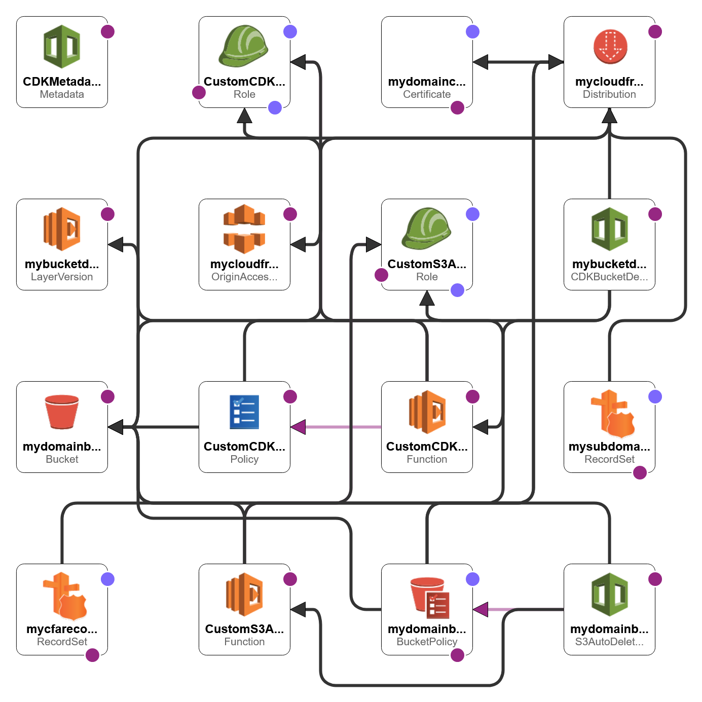

# ThatsMidnight.com

Repository for ThatsMidnight's personal static website hosted on S3.

## Summary

This project deploys various AWS infrastructure resources to host a static website on S3 accessed via CloudFront. The CloudFront distribution provides HTTPS access to a private S3 bucket hosting a static website. Thanks to CORS (cross-origin resource sharing), we can include things like a SoundCloud embed without it being blocked by CloudFront, S3, etc. Assuming our domain name is hosted on Route 53, the certificate can validate via DNS which allows for a much more streamlined deployment process.

We will go into greater detail below about how all the resources work together.

## Resources

The table below shows all the *relevant* resources deployed by this CDK stack.

| **Type** | **Name** | **Description** |
| --- | --- | --- |
| S3 bucket | `thatsmidnight.com` | S3 bucket holding all the static files for our website |
| Certificate | `my-domain-certificate` | The certificate that provides access to the private S3 bucket via CloudFront |
| CloudFront Distribution | `my-cloudfront-distribution` | A CloudFront distribution to provide our web content to users with low latency via edge locations |
| CloudFront Origin Access Identity (legacy) | `my-static-website-stack` | Access resource to send authenticated requests to the Amazon S3 origin from CloudFront |
| Route 53 Record set | `my-cf-a-record`, `my-subdomain-cf-a-record` | Route 53 hosted zone A records for the root domain and subdomain (`www`) |

This image was exported from AWS CloudFormation Designer of our template as of this writing.

### S3 bucket

The S3 bucket is the resource that holds the static files of our website. Since the bucket isn't set as a standalone website, there's no need to name it `"thatsmidnight.com"`, but it makes it easy to identify and understand what it's for.

The nice thing is, with the current configuration, we can keep the bucket *private* and encrypted (default), but still provide access to anyone ***securely*** using CloudFront and Certificate Manager.

However, if you want to bypass the CloudFront and Certificate stuff (if you don't care too much about security), then you could just make your S3 bucket a static website by setting the `website_index_document` property of your `aws_cdk.aws_s3.Bucket` resource. Going down this route would mean that you *need* your bucket to be named the same as your domain name. Check the documentation [here](https://docs.aws.amazon.com/cdk/api/v2/python/aws_cdk.aws_s3/Bucket.html) to learn more!

#### CORS

**[Cross-origin resource sharing](https://docs.aws.amazon.com/AmazonS3/latest/userguide/cors.html)** is the way that your S3 resources will be able to interact with other resources hosted outside your domain. This enables things like web application embeds to work on your website. For example, you could have a track from SoundCloud embedded on your site.

### CloudFront distribution

A CloudFront distribution serves a dual purpose in this stack:

1. Give users a low-latency experience of our website's content thanks to the worldwide network of data centers called ["edge locations"](https://wa.aws.amazon.com/wellarchitected/2020-07-02T19-33-23/wat.concept.edge-location.en.html).
    - There are more advantages to using a CloudFront distribution, but please read up on the [documentation](https://docs.aws.amazon.com/AmazonCloudFront/latest/DeveloperGuide/Introduction.html) for yourself!
2. Provide authenticated access (HTTPS) to users via the [OAI](#cloudfront-origin-access-identity-legacy) using a signed [certificate](#certificate).

I'm not going to talk about the first point here since, to me, it's not as interesting as the second point.

The cool stuff is what *you* can use it for in terms of access and security. But, these things aren't achieved by the distribution alone. To get the website behind HTTPS and access your private content on S3, you need a [certificate](#certificate) and an [OAI](#cloudfront-origin-access-identity-legacy).

### Certificate

To secure the content behind HTTPS the distribution needs a certificate either provided by CloudFront for the distribution's domain or for your custom domain name(s).

### CloudFront Origin Access Identity (legacy)

When you create a distribution, you have to tell it what the **origin** is. In this case, the origin is our S3 bucket because that's where all the files will be. But, when you define your origin, you can also specify an origin access identity that the distribution can use to view the bucket's content while maintaining a *private* and *encrypted* bucket that is ***not*** directly accessible to the public.
